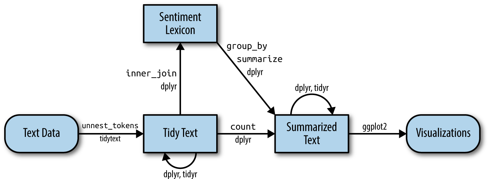

# Sentiment analysis with tidy data

**Learning objectives:**

- Learn how to use tidytext approach to find sentiment of a text
- Learn about diff sentiment lexicon

- Learn how to use Wordcloud


## Sentiment analysis with tidy data

- Many approach for sentiment analysis: 
    
    - Lexicon-based : Interpretable result
    - Machine learning based : better performance

```{r tidyflow-ch2, echo = FALSE, out.width = '100%', fig.cap = "A flowchart of a typical text analysis that uses tidytext for sentiment analysis. This chapter shows how to implement sentiment analysis using tidy data principles."}

```


## Sentiment/emotion Lexicons

 - Sentiment lexicon is a dictionary of word with thier semantic orientation
 - General sentiment lexicon 
 
    - bing : positive and negative
    - nrc : positive, negative, anger, anticipation, disgust, fear, joy, sadness, surprise, and trust
    - AFINN : Assign scores to words (-5 to +5)
 - Domain-specific Sentiment lexicon performs better, but difficult to generate
 
 - Lexicon can be Unigram and ngram
 
 - issue with text with many paragraphs (can often have positive and negative sentiment averaged out to about zero)
 
 - How are sentiment lexicon created
    
    - crowdsourcing (using, for example, Amazon Mechanical Turk) 
    - by the labor of one of the authors.
 
 
```{r 02-02, message=FALSE, warning=FALSE, paged.print=FALSE}
library(tidyverse)
library(tidytext)
library(janeaustenr)
library(stringr)
library(lexicon)

```

Note: These sentiments aren't shown in the online version of these notes, because they need to be manually downloaded for licensing reasons.

```{r 02-03, eval = FALSE}
head(get_sentiments("afinn"))

```

```{r 02-04, eval = FALSE}
head(get_sentiments("bing"))
```


```{r 02-05, message=FALSE, warning=FALSE}

nrc_emotions_lex <- read_tsv("data/NRC-Emotion-Lexicon-Wordlevel-v0.92.txt", col_names = FALSE) 

head(nrc_emotions_lex)

```


```{r 02-06, message=FALSE, warning=FALSE}
# get_sentiments("nrc") is not working

nrc_emotions_lex <- read_tsv("data/NRC-Emotion-Lexicon-Wordlevel-v0.92.txt", col_names = FALSE) %>%
  rename( "word" = 1,  "sentiment" = 2, "score" = 3) %>% 
   select(-score)

head(nrc_emotions_lex)
```


```{r 02-07}
head(lexicon::nrc_emotions)
```


## Sentiment analysis with inner join


- With data in a tidy format, sentiment analysis can be done as an **inner join**. 

- text mining as a tidy data analysis task; much as removing stop words is an **antijoin** operation, performing sentiment analysis is an **inner join** operation.


```{r 02-08}
austen_books() 
```


```{r 02-09}

(books <- austen_books() %>%
  group_by(book) %>%
  mutate(linenumber = row_number(),
         chapter = cumsum(str_detect(text, regex("^chapter [\\divxlc]", 
                                      ignore_case = TRUE)))) %>%
                                      ungroup() )
  

```


```{r 02-10}
(tidy_books <- books %>% 
  unnest_tokens(words, text))
```


```{r 02-11, message=FALSE, warning=FALSE}
# nrc_joy <- get_sentiments("nrc") # does not work

nrc_emotions_lex <- read_tsv("data/NRC-Emotion-Lexicon-Wordlevel-v0.92.txt", col_names = FALSE) %>%
  rename( "words" = 1,  "sentiment" = 2, "score" = 3) %>% 
   select(-score)
 
```


```{r 02-12}
nrc_joy <- nrc_emotions_lex %>% 
  filter(sentiment == "joy")

nrc_joy
```

```{r 02-13}
tidy_books %>%
  filter(book == "Emma")%>%
  inner_join(nrc_joy) %>%
  count(words, sort = TRUE)
```

## Examining how sentiment changes in each novel


```{r 02-14}
(tidy_books <- books %>% 
  unnest_tokens(word, text))
```


```{r 02-15}
jane_austen_sentiment <- tidy_books %>%
  inner_join(get_sentiments("bing"), by = "word") %>% 
  count(book, index = linenumber %/% 80, sentiment) %>%
  pivot_wider(names_from = sentiment, values_from = n, values_fill = 0) %>% 
  mutate(sentiment = positive - negative)

jane_austen_sentiment

```
> Now we can plot these sentiment scores across the plot trajectory of each novel. plotting against the index on the x-axis that keeps track of narrative time in sections of text.

```{r 02-16}
library(ggplot2)

ggplot(jane_austen_sentiment, aes(index, sentiment, fill = book)) +
  geom_col(show.legend = FALSE) +
  facet_wrap(~book, ncol = 2, scales = "free_x")
```


## Comparing the three sentiment dictionaries

- Lexicons have diff quality

- Use three sentiment lexicons and examine how the sentiment changes across the narrative arc of Pride and Prejudice.


```{r 02-17}
pride_prejudice <- tidy_books %>% 
  filter(book == "Pride & Prejudice")
pride_prejudice
```


```{r 02-18, eval = FALSE}
afinn <- pride_prejudice %>% 
  inner_join(get_sentiments("afinn")) %>% 
  group_by(index = linenumber %/% 80) %>% 
  summarise(sentiment = sum(value)) %>% 
  mutate(method = "AFINN")
```


```{r 02-19}
bin_pride_prejudice <-  pride_prejudice %>% 
    inner_join(get_sentiments("bing")) %>%
    mutate(method = "Bing et al.") %>% 
 count(method, index = linenumber %/% 80, sentiment) %>%
  pivot_wider(names_from = sentiment,
              values_from = n,
              values_fill = 0) %>% 
  mutate(sentiment = positive - negative)

```


```{r 02-20, eval = FALSE}
bind_rows(afinn, 
          bin_pride_prejudice) %>%
  ggplot(aes(index, sentiment, fill = method)) +
  geom_col(show.legend = FALSE) +
  facet_wrap(~method, ncol = 1, scales = "free_y")
```

- The  lexicons for calculating sentiment give results that are different in an absolute sense but have similar relative trajectories through the nove


## Most common positive and negative words


- One advantage of having the data frame with both sentiment and word is that we can analyze word counts that contribute to each sentiment

```{r 02-21, eval = FALSE}
bing_word_counts <- tidy_books %>%
  inner_join(get_sentiments("bing")) %>%
  count(word, sentiment, sort = TRUE) %>%
  ungroup()

bing_word_counts
```


```{r 02-22, eval = FALSE}
bing_word_counts %>%
  group_by(sentiment) %>%
  slice_max(n, n = 10) %>% 
  ungroup() %>%
  mutate(word = reorder(word, n)) %>%
  ggplot(aes(n, word, fill = sentiment)) +
  geom_col(show.legend = FALSE) +
  facet_wrap(~sentiment, scales = "free_y") +
  labs(x = "Contribution to sentiment",
       y = NULL)
```


```{r 02-23}
custom_stop_words <- bind_rows(tibble(word = c("miss"),  
                                      lexicon = c("custom")), 
                               stop_words)


custom_stop_words
```


```{r 02-24, eval = FALSE}
bing_word_counts %>% 
  anti_join(custom_stop_words, by = "word") %>% 
  group_by(sentiment) %>%
  slice_max(n, n = 10) %>% 
  ungroup() %>%
  mutate(word = reorder(word, n)) %>%
  ggplot(aes(n, word, fill = sentiment)) +
  geom_col(show.legend = FALSE) +
  facet_wrap(~sentiment, scales = "free_y") +
  labs(x = "Contribution to sentiment",
       y = NULL)
```

## Wordclouds

```{r 02-25, message=FALSE, warning=FALSE}
library(wordcloud)

tidy_books %>%
  anti_join(stop_words) %>%
  count(word) %>%
  with(wordcloud(word, n, max.words = 100))
```

> In other functions, such as comparison.cloud(), you may need to turn the data frame into a matrix with reshape2’s acast()

```{r 02-26, message=FALSE, warning=FALSE}
library(reshape2)

tidy_books %>%
  inner_join(get_sentiments("bing")) %>%
  count(word, sentiment, sort = TRUE) %>%
  acast(word ~ sentiment, value.var = "n", fill = 0) %>%
  comparison.cloud(colors = c("gray20", "gray80"),
                   max.words = 100)
```


## Looking at units beyond just words


- Unigram cannot handle Negation e.g I am not having a good day.

- coreNLP (T. Arnold and Tilton 2016), cleanNLP (T. B. Arnold 2016), and sentimentr (Rinker 2017).


```{r 02-27}
bingnegative <- get_sentiments("bing") %>% 
  filter(sentiment == "negative")

wordcounts <- tidy_books %>%
  group_by(book, chapter) %>%
  summarize(words = n())

tidy_books %>%
  semi_join(bingnegative) %>%
  group_by(book, chapter) %>%
  summarize(negativewords = n()) %>%
  left_join(wordcounts, by = c("book", "chapter")) %>%
  mutate(ratio = negativewords/words) %>%
  filter(chapter != 0) %>%
  slice_max(ratio, n = 1) %>% 
  ungroup()
```

> These are the chapters with the most sad words in each book, normalized for number of words in the chapter.

## Meeting Videos

### Cohort 1

`r knitr::include_url("https://www.youtube.com/embed/URL")`

<details>
<summary> Meeting chat log </summary>

```
ADD LOG HERE
```
</details>


