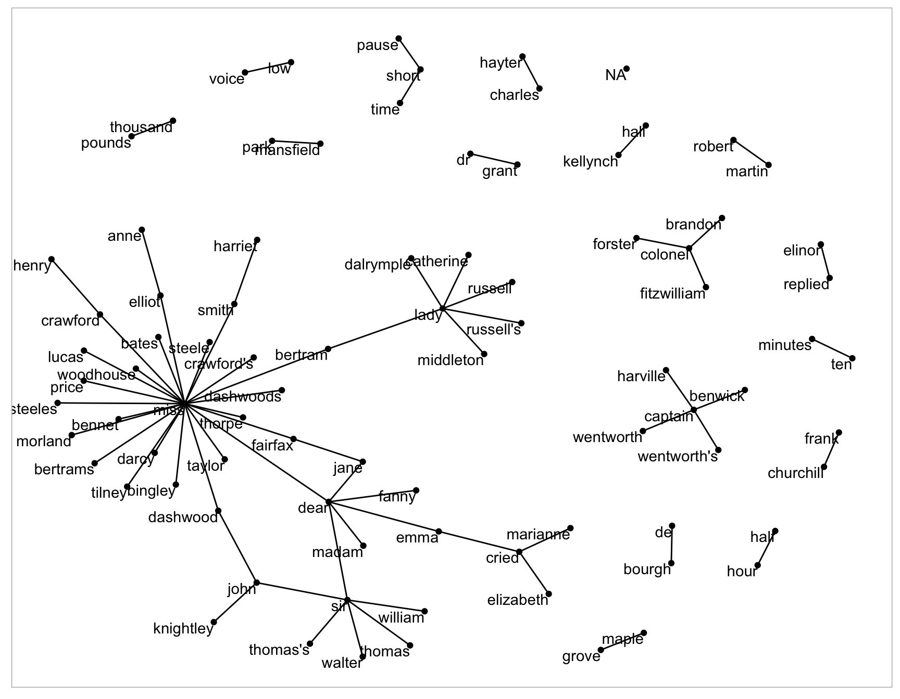
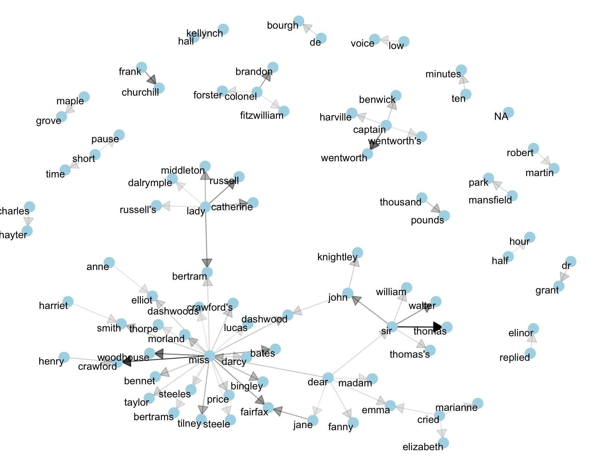

--- 
title: "Text Mining with R Book Club"
author: "The R4DS Online Learning Community"
date: "`r Sys.Date()`"
site: bookdown::bookdown_site
documentclass: book
bibliography: book.bib
biblio-style: apalike
link-citations: yes
github-repo: r4ds/bookclub-tidytext
description: "This is the product of the R4DS Online Learning Community's Text Mining with R Book Club."
---

# Welcome {-}

Placeholder


## Book club meetings {-}
## Pace {-}
## Book Chapters {-}

<!--chapter:end:index.Rmd-->


# The Tidy Text Format

Placeholder


## Contrasting Tidy Text with Other Data Structures
## The unnest_tokens Function 
## Example 1: Tidying the works of Jane Austen
## Example 2: The `gutenbergr` package
## A flowchart of a typical text analysis using tidy data priciples.
## Meeting Videos
### Cohort 1

<!--chapter:end:01.Rmd-->

# Relationships between words: n-grams & correlations

## Objectives: 

- Understand how to extract relationships between words 
- Understand how text analyses examine which words tend to follow others 
- Understand how to analyse text to determine which words tend to co-occur

## Tokeninzing by n-grams

**n-gram: pair of adjacent words. Useful for identifying frequencies in which certain words appear together so that a model of their relationship can be built.**


```{r ngrams1, eval=TRUE, message=FALSE, warning=FALSE}
library(dplyr)
library(tidytext)
library(janeaustenr)

# utilize unnest_tokens() however specify the token is "ngram" and n instead of by words
austen_bigrams <- austen_books() %>%
  unnest_tokens(bigram, text, token = "ngrams", n = 2)

head(austen_bigrams)

```

OK, how about again with some real data:

```{r ngrams-covid, eval=TRUE}
# from Kaggle: https://www.kaggle.com/datatattle/covid-19-nlp-text-classification?select=Corona_NLP_train.csv
covid_tweets <- readr::read_csv("data/Corona_NLP_train.csv")

covid_bigrams <- covid_tweets %>%
  select(OriginalTweet, Sentiment) %>% 
  unnest_tokens(bigram, OriginalTweet, token = "ngrams", n = 2)

head(covid_bigrams)

```

This output clearly needs to be filtered 

```{r covid2, eval=TRUE}
covid_bigrams %>%
  count(bigram, sort = TRUE)

```

Filter stop-words.
**stop-words: uninteresting or common words such as "of", "the", "be"**

In order to filter out stop words, we need to separate out the bigrams into separate columns using the `separate()` function from `tidyr`.

```{r covid2a, eval=TRUE, message=FALSE, warning=FALSE}
library(tidyr)

bigrams_separated <- covid_bigrams %>%
  separate(bigram, c("word1", "word2"), sep = " ")

# n = 1,275,993 to n = 393,315
bigrams_filtered <- bigrams_separated %>%
  filter(!word1 %in% stop_words$word) %>%
  filter(!word2 %in% stop_words$word)

# new bigram counts:
bigram_counts <- bigrams_filtered %>% 
  count(word1, word2, sort = TRUE)
# n = 216,367
```

Clearly there are a lot of people posting links on Twitter (t.co) because of the shortened URLs.

Now that we've filtered out the stopwords, let's unite the words to create more true bigrams (no stopwords) again.

```{r covid3, eval=TRUE}
bigrams_united <- bigrams_filtered %>%
  unite(bigram, word1, word2, sep = " ")

bigrams_united

```

**IF we were interested in trigrams, we can repeat the sequence with n=3**

```{r covid4, eval=TRUE}
covid_tweets %>%
  select(OriginalTweet, Sentiment) %>% 
  unnest_tokens(trigram, OriginalTweet, token = "ngrams", n = 3) %>%
  separate(trigram, c("word1", "word2", "word3"), sep = " ") %>%
  filter(!word1 %in% stop_words$word,
         !word2 %in% stop_words$word,
         !word3 %in% stop_words$word) %>%
  count(word1, word2, word3, sort = TRUE)
```

### Analyzing bigrams

This dataset does not really give us a grouping variable like the Austen data but they do include sentiment. Let's try grouping by sentiments the curators have determined the tweets to be to get the which words are most associated with "shopping".

```{r covid5, eval=TRUE}
bigrams_filtered %>%
  filter(word2 == "shopping") %>%
  count(Sentiment, word1, sort = TRUE)
```

Bigrams can be used treated like documents. We can look at the tf-idf and visualize based on sentiment.


```{r covid6, eval=TRUE}
bigram_tf_idf <- bigrams_united %>%
  count(Sentiment, bigram) %>%
  bind_tf_idf(bigram, Sentiment, n) %>%
  arrange(desc(tf_idf))

bigram_tf_idf
```

**Visualizing tf-idf**
```{r 01-example1_ggplot, eval=TRUE, message=FALSE, warning=FALSE}
library(forcats)
library(ggplot2)

bigram_tf_idf %>%
  group_by(Sentiment) %>%
  slice_max(tf_idf, n = 15) %>%
  ungroup() %>%
  ggplot(aes(tf_idf, fct_reorder(bigram, tf_idf), fill = Sentiment)) +
  geom_col(show.legend = FALSE) +
  facet_wrap(~Sentiment, ncol = 2, scales = "free") +
  labs(x = "tf-idf", y = NULL)
```

*Takeaway- bigrams are informative and can make tokens more understandable they do make the counts more sparse (a two-word pair is more rare). These can be useful in very large datasets*

### Using bigrams to provide context in sentiment analysis

This dataset already contains sentiment of the overall tweet but as we saw in the tf-idf visual, they don't really make much sense in context of just the bigram. So, let's re-do it. This could make a difference given the context, such as the usage of "not" before "happy". 

```{r covid8, eval=TRUE}
bigrams_separated %>%
  filter(word1 == "not") %>%
  count(word1, word2, sort = TRUE)
```

AFINN will be used to assign a numeric value for each word associated with "not"

```{r covid9, eval=TRUE}
AFINN <- get_sentiments("afinn")

# get the most frequent words preceded by "not"
not_words <- bigrams_separated %>%
  filter(word1 == "not") %>%
  inner_join(AFINN, by = c(word2 = "word")) %>%
  count(word2, value, sort = TRUE)

# n = 194
not_words
```

The most common sentiment-associated word following "not" is "panic". Panic is pretty negative but NOT panic can be more positive. 

Computing how influential the certain words were in understanding the context in the wrong direction.
*This is done in the book by multiplying the their frequency by their sentiment value.* 


```{r covid10, eval=TRUE}
not_words %>%
  mutate(contribution = n * value) %>%
  arrange(desc(abs(contribution))) %>%
  head(20) %>%
  mutate(word2 = reorder(word2, contribution)) %>%
  ggplot(aes(n * value, word2, fill = n * value > 0)) +
  geom_col(show.legend = FALSE) +
  labs(x = "Sentiment value * number of occurrences",
       y = "Words preceded by \"not\"")
```
Panic looks *very influential*.

**Let's try again with more negation terms**
```{r covid11, eval=TRUE}
negation_words <- c("not", "no", "never", "without")

negated_words <- bigrams_separated %>%
  filter(word1 %in% negation_words) %>%
  inner_join(AFINN, by = c(word2 = "word")) %>%
  count(word1, word2, value, sort = TRUE)
# n=342

negated_words %>%
  mutate(contribution = n * value) %>%
  arrange(desc(abs(contribution))) %>%
  head(20) %>%
  mutate(word2 = reorder(word2, contribution)) %>%
  ggplot(aes(n * value, word2, fill = n * value > 0)) +
  geom_col(show.legend = FALSE) +
  facet_wrap(~word1, ncol = 2, scales = "free") +
  labs(x = "Sentiment value * number of occurrences",
       y = "Words preceded by \"not\"")
```

### Visualizing network of bigrams with ggraph

Relationships between words can be visualized using a node graph. 
**nodes: subject (where the edge is coming from), object (where the edge is going to), edge(association between nodes that have weight)**


```{r igraph, eval=FALSE}
library(igraph)

# original counts
bigram_counts

# filter for only relatively common combinations
bigram_graph <- bigram_counts %>%
  filter(n > 20) %>%
  graph_from_data_frame()

bigram_graph
```

Now that the igraph object has been created, we must plot it with ggraph!

```{r igraph2, eval=FALSE}
set.seed(2017)

ggraph(bigram_graph, layout = "fr") +
  geom_edge_link() +
  geom_node_point() +
  geom_node_text(aes(label = name), vjust = 1, hjust = 1)
```

This is what it would look like:



```{r igraph3, eval=FALSE}

set.seed(2020)

a <- grid::arrow(type = "closed", length = unit(.15, "inches"))

ggraph(bigram_graph, layout = "fr") +
  geom_edge_link(aes(edge_alpha = n), show.legend = FALSE,
                 arrow = a, end_cap = circle(.07, 'inches')) +
  geom_node_point(color = "lightblue", size = 5) +
  geom_node_text(aes(label = name), vjust = 1, hjust = 1) +
  theme_void()

```

This is a visualization of a **Markov Chain**



*Markov Chain: common model in text analysis. It is a stochastic model that describes a sequence of possible events where the probability of a subsequent event depends on the state of the previous event. In this case, words are assigned probabilities and then the likelihood of the next word depends on the prior word. For example, in a word generator, if the word is "restaurant", there is a good chance the following word may be "reservation".*


## Counting and correlating pairs of words with `widyr`

Understanding where words co-occur in documents, even though they may not occur next to each other is another piece of useful information.

`widyr` = a package to make matrix operations, like pairwise counts or correlations between two words in the same document, on tidy data easier.


For the purposes of our covid example, lets look at only tweets that are "Extremely Positive" and then group them into chunks of 10 tweets. By the way, these tweets span between 03/01/2020 to 04/01/2020. It would have probably been better to convert the `TweetAt` variable into a date and sort so that we can have chunks in chronological order...

```{r widy, eval=TRUE}
covid_chunk_words <- covid_tweets %>%
  filter(Sentiment == "Extremely Positive") %>%
  mutate(chunk = row_number() %/% 10) %>%
  filter(chunk > 0) %>%
  unnest_tokens(word, OriginalTweet) %>%
  filter(!word %in% stop_words$word)

covid_chunk_words


```


```{r widy2, eval=TRUE}
library(widyr)

# count words co-occuring within sections
word_pairs <- covid_chunk_words %>%
  pairwise_count(word, chunk, sort = TRUE)

word_pairs


```

Most common pair of words are links, but outside of those is "covid-19" and "store"

```{r widy3, eval=TRUE}
word_pairs %>%
  filter(item1 == "store")


```

### Pairwise correlation

```{r cor, eval=TRUE}
# we need to filter for at least relatively common words first
word_cors <- covid_chunk_words %>%
  group_by(word) %>%
  filter(n() >= 20) %>%
  pairwise_cor(word, chunk, sort = TRUE)

word_cors

```

Let's find words most correlated to "store"

```{r cor2, eval=TRUE}
word_cors %>%
  filter(item1 == "store")

```


```{r cor3, eval=TRUE}
word_cors %>%
  filter(item1 %in% c("store", "workers", "online", "sanitizer")) %>%
  group_by(item1) %>%
  slice_max(correlation, n = 6) %>%
  ungroup() %>%
  mutate(item2 = reorder(item2, correlation)) %>%
  ggplot(aes(item2, correlation)) +
  geom_bar(stat = "identity") +
  facet_wrap(~ item1, scales = "free") +
  coord_flip()
```


<!--chapter:end:04-relationships.Rmd-->

